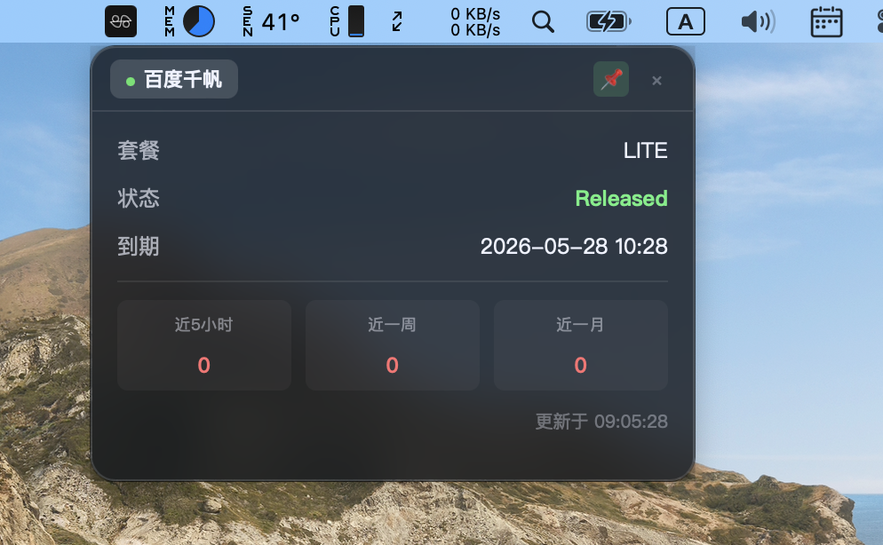

# Code Plan (Token Plan) 套餐余量桌面小工具

一款轻量级桌面小工具，用于实时监控各大平台的 Code Plan(Token Plan) 套餐使用情况。

### 让你养`🦞龙虾`时掌握`龙虾饲料`的剩余情况,养`🦞龙虾`才能更安心.

## ✨ 功能特性

- 🎯 **实时监控** - 自动获取套餐状态、用量、剩余天数等关键信息
- 🪟 **悬浮窗显示** - 透明悬浮窗，可拖拽、可折叠，不遮挡工作区
- 🔄 **多服务商支持** - 目前支持阿里云百炼、百度千帆，架构可扩展
- � **配额可视化** - 近5小时/近一周/近一月用量一目了然
- 💾 **原生应用** - 基于 Tauri 构建，资源占用低，启动快速

## 🎨 界面预览



### 控制面板
启动后显示服务商连接管理界面，点击「连接」按钮登录对应平台：

- 阿里云百炼：百炼控制台 · 资源包 & 用量监控
- 百度千帆：千帆控制台 · 订阅资源监控


### 授权提醒与免责声明:

一、使用授权说明
您安装、使用本软件即视为自愿授权本软件代替您手动向对应云厂商发送HTTP请求以获取相关数据。本软件所有数据获取行为均模拟您的手动操作路径，仅会将获取到的信息在您当前安装本软件的设备本地进行展示，不会主动向任何第三方服务器上传您的任何个人数据、操作记录或获取到的云厂商相关信息，核心功能仅为替代人工完成定时数据获取与本地展示。
若您不同意上述授权条款，请立即停止使用本软件，并完整卸载、删除所有相关文件。

二、使用边界说明
本软件为非盈利性开源项目，仅作个人学习、技术交流用途，禁止任何主体将其用于商业盈利场景。开发团队不向任何用户提供付费技术支持、商业授权服务，所有商业合作相关问询均不予回应。

三、免责与侵权处理
本软件开发者不对您使用本软件过程中产生的任何直接、间接损失承担责任，包括但不限于云厂商服务限制、数据偏差、设备异常等情况。
若本软件相关内容存在侵犯您合法权益的情况，请您携带权属证明材料与开发团队联系，我们核实情况后将第一时间删除相关侵权内容、调整对应功能。

** 本工具不会主动存储cookie等任何个人信息，仅依赖浏览器自身存储机制，严禁用于抓取他人数据、商业爬虫或任何违反平台用户协议的行为。使用者需自行承担因违反平台协议导致的一切后果（包括但不限于封号）。**

**展开模式**：
- 套餐名称、状态、剩余天数
- 有效期、近期用量统计
- 配额分组（5小时/一周/一月）
- 多服务商 Tab 切换

**折叠模式**：
- 紧凑显示关键信息
- 点击展开按钮或双击恢复完整视图
- 自动吸附屏幕角落

## 🚀 快速开始

### 环境要求

#### 必需软件
- **Node.js** (v18+)
- **Rust** (最新稳定版)
- **pnpm/npm/yarn**

#### 平台特定要求

**Windows**
- Microsoft Visual Studio C++ Build Tools
- WebView2 (Windows 10/11 已预装)

**macOS**
```bash
xcode-select --install
```

**Linux**
```bash
sudo apt update
sudo apt install libwebkit2gtk-4.1-dev \
    build-essential \
    curl \
    wget \
    libssl-dev \
    libgtk-3-dev \
    libayatana-appindicator3-dev \
    librsvg2-dev
```

### 安装与运行

```bash
# 1. 克隆项目
git clone <repository-url>
cd lsys-cloud-monitor

# 2. 安装依赖
pnpm install

# 3. 开发模式运行
pnpm run tauri dev

# 4. 构建生产版本
pnpm run tauri build
```

## 📖 使用说明

1. **启动应用** - 首次启动会显示控制面板
2. **配置刷新间隔** - 在控制面板顶部设置数据刷新间隔（10-600秒，默认60秒）
3. **连接服务商** - 点击「连接」按钮，在弹出的 WebView 中登录对应平台
4. **自动监控** - 登录成功后，控制面板自动收起，悬浮窗显示实时数据
5. **查看数据** - 悬浮窗按配置的间隔自动刷新数据
6. **切换服务商** - 在悬浮窗顶部 Tab 栏切换不同服务商
7. **折叠/展开** - 点击右上角按钮手动切换显示模式
8. **重新打开** - 通过系统托盘图标可重新打开控制面板服务商
6. **折叠/展开** - 点击右上角按钮手动切换显示模式
7. **重新打开** - 通过系统托盘图标可重新打开控制面板

## 🏗️ 项目结构

```
.
├── public/                      # 前端页面
│   ├── control.html            # 控制面板（服务商连接管理）
│   └── overlay.html            # 悬浮窗（数据展示）
├── src/
│   └── main.ts                 # 前端入口
├── src-tauri/                  # Rust 后端
│   ├── src/
│   │   ├── main.rs            # 主程序入口
│   │   ├── overlay.rs         # 悬浮窗逻辑
│   │   ├── window.rs          # 窗口管理
│   │   ├── tray.rs            # 系统托盘
│   │   └── providers/         # 服务商适配器
│   │       ├── mod.rs         # Provider 接口定义
│   │       ├── aliyun.rs      # 阿里云百炼
│   │       └── baidu.rs       # 百度千帆
│   ├── Cargo.toml             # Rust 依赖
│   └── tauri.conf.json        # Tauri 配置
├── package.json
└── vite.config.ts
```

## 🔌 支持的服务商

### 阿里云百炼
- **监控内容**：套餐状态、剩余天数、近5小时/一周/一月用量
- **目标页面**：百炼控制台 > 资源 > 我的订阅 > Coding Plan
- **登录方式**：阿里云账号登录

### 百度千帆
- **监控内容**：资源包状态、Token 配额与剩余、到期日期
- **目标页面**：千帆控制台 > 资源 > 我的订阅
- **登录方式**：百度账号登录

## 🛠️ 扩展新服务商

项目采用 Provider 模式，添加新服务商只需三步：

1. **创建 Provider 文件** - 在 `src-tauri/src/providers/` 下新建 `xxx.rs`
2. **实现 ProviderConfig** - 定义目标 URL、注入脚本、数据提取逻辑
3. **注册 Provider** - 在 `providers/mod.rs` 的 `all_providers()` 中添加

参考 `aliyun.rs` 或 `baidu.rs` 的实现模式。

## 🔧 技术栈

- **前端**: TypeScript + Vite + 原生 JavaScript
- **后端**: Rust + Tauri 2.0
## 💡 工作原理

1. **控制面板** - 管理服务商连接状态和刷新间隔配置，调用 Tauri 命令创建 Provider WebView
2. **Provider WebView** - 加载服务商控制台，注入 JavaScript 脚本
3. **注入脚本** - 检测登录状态、提取页面数据、通过 Tauri Event 上报
4. **悬浮窗** - 接收数据事件，更新 UI 显示
5. **自动刷新** - 注入脚本按配置的间隔定时拉取最新数据（可在控制面板动态调整）制台，注入 JavaScript 脚本
3. **注入脚本** - 检测登录状态、提取页面数据、通过 Tauri Event 上报
4. **悬浮窗** - 接收数据事件，更新 UI 显示
5. **自动刷新** - 注入脚本每 60 秒定时拉取最新数据

## ⚠️ 常见问题

### macOS 安装与打开应用

由于应用未经过 Apple 代码签名，需要按以下步骤安装：

**完整安装步骤：**

1. **下载并打开 DMG 文件** - 双击下载的 `.dmg` 文件
2. **拖拽安装** - 在弹出的安装窗口中，将应用图标拖拽到 `Applications` 文件夹
3. **首次打开** - 前往 `Applications` 文件夹，找到应用
4. **绕过安全检查** - 使用以下任一方法：
   - **方法一（推荐）**：按住 `Control` 键点击应用 → 选择"打开" → 点击"打开"按钮
   - **方法二**：右键点击应用 → 选择"打开" → 点击"打开"按钮
   - **方法三**：在"系统设置" → "隐私与安全性"中找到被阻止的应用，点击"仍要打开"
   - **方法四**：在终端运行以下命令：
     ```bash
     xattr -cr /Applications/lsys-cloud-monitor.app
     ```
5. **后续使用** - 完成首次打开后，之后可以正常双击启动

**注意**：直接在 DMG 窗口中打开应用可能会导致权限问题，请务必先拖拽到 Applications 文件夹。

### WebView2 未安装 (Windows)
下载并安装 [Microsoft Edge WebView2 Runtime](https://developer.microsoft.com/en-us/microsoft-edge/webview2/)

### 编译错误
确保 Rust 版本 >= 1.70：
```bash
rustup update stable
```

## 📄 许可证

MIT License

## 🤝 贡献

欢迎各位CLONE代码添加新的服务商支持,欢迎提交 Issue 和 Pull Request！
